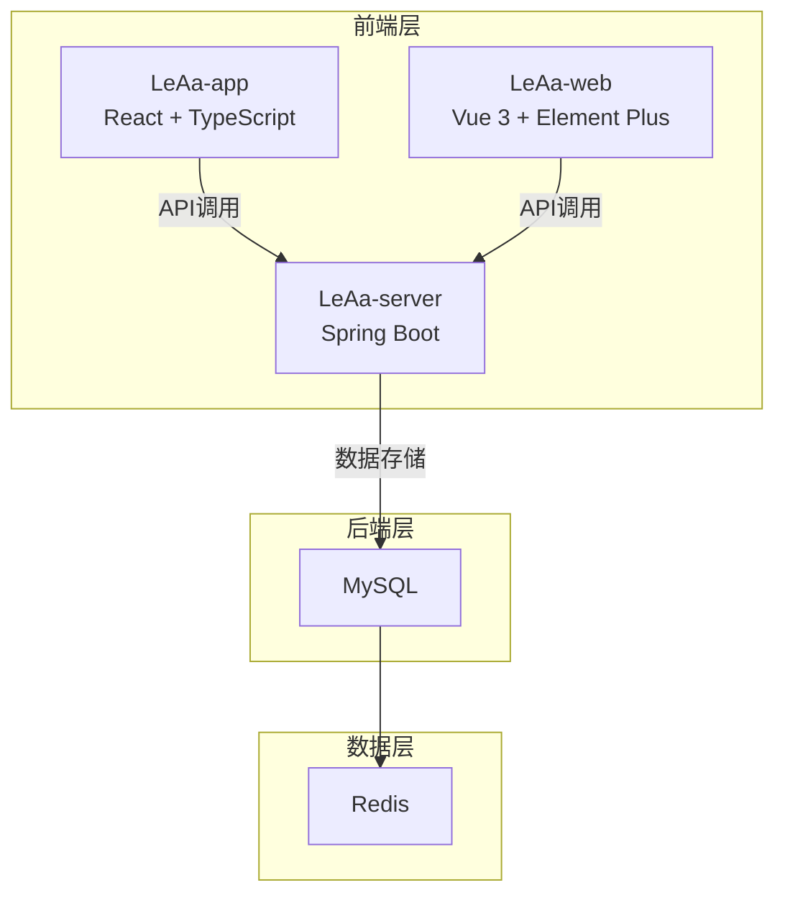

# LeAa 项目 Code Wiki

## 1. 项目概述

LeAa 是一个综合性的活动管理平台，包含三个主要部分：

- **LeAa-app**：React 前端应用，用于活动管理、据点管理、聊天等功能
- **LeAa-server**：Java 后端应用，基于 Spring Boot，提供完整的后台管理系统
- **LeAa-web**：Vue 3 前端应用，基于 Element Plus，提供后台管理界面

## 2. 项目架构

### 2.1 整体架构



### 2.2 技术栈

| 项目 | 技术栈 | 版本 |
|------|-------|------|
| LeAa-app | React + TypeScript + Vite | React 18+ |
| LeAa-server | Java + Spring Boot + MySQL + Redis | Spring Boot 2.7.18 |
| LeAa-web | Vue 3 + TypeScript + Vite + Element Plus | Vue 3.3.8 |

## 3. 模块详解

### 3.1 LeAa-app（React前端）

#### 3.1.1 目录结构

```
LeAa-app/
├── public/
│   └── favicon.svg
├── src/
│   ├── assets/           # 静态资源
│   ├── components/       # 组件
│   ├── data/             # 模拟数据
│   ├── hooks/            # 自定义钩子
│   ├── lib/              # 工具库
│   ├── pages/            # 页面
│   ├── store/            # 状态管理
│   ├── App.tsx           # 应用入口
│   ├── index.css         # 全局样式
│   └── main.tsx          # 主入口
├── package.json          # 依赖配置
└── vite.config.ts        # Vite配置
```

#### 3.1.2 主要组件

| 组件名称 | 功能描述 | 文件路径 |
|---------|---------|---------|
| ActivityCard | 活动卡片组件，展示活动信息 | [ActivityCard.tsx](file:///workspace/LeAa-app/src/components/ActivityCard.tsx) |
| BottomNav | 底部导航栏 | [BottomNav.tsx](file:///workspace/LeAa-app/src/components/BottomNav.tsx) |
| CitySelector | 城市选择器 | [CitySelector.tsx](file:///workspace/LeAa-app/src/components/CitySelector.tsx) |
| HubCard | 据点卡片组件，展示据点信息 | [HubCard.tsx](file:///workspace/LeAa-app/src/components/HubCard.tsx) |
| Layout | 布局组件 | [Layout.tsx](file:///workspace/LeAa-app/src/components/Layout.tsx) |

#### 3.1.3 主要页面

| 页面名称 | 功能描述 | 文件路径 |
|---------|---------|---------|
| Home | 首页，展示活动和据点列表 | [Home.tsx](file:///workspace/LeAa-app/src/pages/Home.tsx) |
| Activities | 活动列表页 | [Activities.tsx](file:///workspace/LeAa-app/src/pages/Activities.tsx) |
| ActivityDetail | 活动详情页 | [ActivityDetail.tsx](file:///workspace/LeAa-app/src/pages/ActivityDetail.tsx) |
| CreateActivity | 创建活动页 | [CreateActivity.tsx](file:///workspace/LeAa-app/src/pages/CreateActivity.tsx) |
| Settlement | 结算页 | [Settlement.tsx](file:///workspace/LeAa-app/src/pages/Settlement.tsx) |
| Rating | 评分页 | [Rating.tsx](file:///workspace/LeAa-app/src/pages/Rating.tsx) |
| Chat | 聊天页 | [Chat.tsx](file:///workspace/LeAa-app/src/pages/Chat.tsx) |
| Hubs | 据点列表页 | [Hubs.tsx](file:///workspace/LeAa-app/src/pages/Hubs.tsx) |
| Profile | 个人中心页 | [Profile.tsx](file:///workspace/LeAa-app/src/pages/Profile.tsx) |
| Result | 结果页 | [Result.tsx](file:///workspace/LeAa-app/src/pages/Result.tsx) |

#### 3.1.4 路由配置

路由配置在 [App.tsx](file:///workspace/LeAa-app/src/App.tsx) 中实现：

```tsx
import { BrowserRouter as Router, Routes, Route } from "react-router-dom";
import Home from "@/pages/Home";
import Activities from "@/pages/Activities";
import ActivityDetail from "@/pages/ActivityDetail";
import Result from "@/pages/Result";
import CreateActivity from "@/pages/CreateActivity";
import Settlement from "@/pages/Settlement";
import Rating from "@/pages/Rating";
import Chat from "@/pages/Chat";
import Hubs from "@/pages/Hubs";
import Profile from "@/pages/Profile";

export default function App() {
  return (
    <Router>
      <Routes>
        <Route path="/" element={<Home />} />
        <Route path="/result" element={<Result />} />
        <Route path="/activities" element={<Activities />} />
        <Route path="/activities/:id" element={<ActivityDetail />} />
        <Route path="/create-activity" element={<CreateActivity />} />
        <Route path="/settlement/:id" element={<Settlement />} />
        <Route path="/rating/:id" element={<Rating />} />
        <Route path="/chat/:id" element={<Chat />} />
        <Route path="/hubs" element={<Hubs />} />
        <Route path="/profile" element={<Profile />} />
      </Routes>
    </Router>
  );
}
```

#### 3.1.5 状态管理

使用自定义钩子进行状态管理，文件路径：[useStore.ts](file:///workspace/LeAa-app/src/store/useStore.ts)

#### 3.1.6 自定义钩子

| 钩子名称 | 功能描述 | 文件路径 |
|---------|---------|---------|
| useImageUpload | 图片上传钩子 | [useImageUpload.ts](file:///workspace/LeAa-app/src/hooks/useImageUpload.ts) |
| useTheme | 主题管理钩子 | [useTheme.ts](file:///workspace/LeAa-app/src/hooks/useTheme.ts) |

#### 3.1.7 工具库

| 工具名称 | 功能描述 | 文件路径 |
|---------|---------|---------|
| supabase | Supabase 客户端配置 | [supabase.ts](file:///workspace/LeAa-app/src/lib/supabase.ts) |
| utils | 通用工具函数 | [utils.ts](file:///workspace/LeAa-app/src/lib/utils.ts) |

### 3.2 LeAa-server（Java后端）

#### 3.2.1 目录结构

```
LeAa-server/
├── yudao-dependencies/    # Maven 依赖版本管理
├── yudao-framework/       # Java 框架拓展
├── yudao-module-system/   # 系统功能模块
├── yudao-module-infra/    # 基础设施模块
├── yudao-server/          # 服务端入口
├── sql/                   # 数据库脚本
├── script/                # 部署脚本
└── pom.xml                # Maven 配置
```

#### 3.2.2 核心模块

| 模块名称 | 功能描述 | 目录路径 |
|---------|---------|---------|
| yudao-dependencies | Maven 依赖版本管理 | [yudao-dependencies](file:///workspace/LeAa-server/yudao-dependencies/) |
| yudao-framework | Java 框架拓展，包含各种 starter | [yudao-framework](file:///workspace/LeAa-server/yudao-framework/) |
| yudao-module-system | 系统功能模块，包括用户、角色、菜单等 | [yudao-module-system](file:///workspace/LeAa-server/yudao-module-system/) |
| yudao-module-infra | 基础设施模块，包括代码生成、文件服务等 | [yudao-module-infra](file:///workspace/LeAa-server/yudao-module-infra/) |
| yudao-server | 服务端入口，整合所有模块 | [yudao-server](file:///workspace/LeAa-server/yudao-server/) |

#### 3.2.3 主要功能

1. **系统功能**
   - 用户管理：用户配置、在线用户监控
   - 角色管理：角色菜单权限分配
   - 菜单管理：系统菜单、操作权限配置
   - 部门管理：组织机构配置
   - 岗位管理：用户职务配置
   - 租户管理：SaaS 多租户功能
   - 短信管理：短信渠道、模板、日志
   - 邮件管理：邮箱账号、模板、发送日志
   - 站内信：系统内消息通知
   - 操作日志：系统操作记录
   - 登录日志：登录记录查询
   - 错误码管理：系统错误码管理
   - 通知公告：系统通知发布
   - 敏感词：系统敏感词配置
   - 应用管理：SSO 单点登录应用管理
   - 地区管理：城市信息管理

2. **工作流程**
   - SIMPLE 设计器：仿钉钉/飞书设计器
   - BPMN 设计器：基于 BPMN 标准
   - 会签、或签、依次审批
   - 抄送、驳回、转办、委派
   - 加签、减签、撤销、终止
   - 表单权限、超时审批、自动提醒
   - 父子流程、条件分支、并行分支
   - 触发节点、延迟节点、拓展设置

3. **支付系统**
   - 应用信息：配置支付渠道
   - 支付订单：查看支付订单
   - 退款订单：查看退款订单
   - 回调通知：查看支付回调结果

4. **基础设施**
   - 代码生成：前后端代码生成
   - 系统接口：基于 Swagger 生成 API 文档
   - 数据库文档：自动生成数据库文档
   - 表单构建：拖动表单元素生成 HTML
   - 配置管理：系统动态配置
   - 定时任务：在线任务调度
   - 文件服务：支持多种存储方式
   - WebSocket：实时通信
   - API 日志：API 访问日志
   - MySQL 监控：数据库连接池状态
   - Redis 监控：Redis 使用情况
   - 消息队列：基于 Redis 实现
   - Java 监控：基于 Spring Boot Admin
   - 链路追踪：接入 SkyWalking
   - 日志中心：接入 SkyWalking
   - 服务保障：分布式锁、幂等、限流

5. **数据报表**
   - 报表设计器：数据报表、图形报表、打印设计
   - 大屏设计器：拖拽生成数据大屏

6. **微信公众号**
   - 账号管理：配置微信公众号
   - 数据统计：公众号数据统计
   - 粉丝管理：粉丝列表管理
   - 消息管理：消息列表管理
   - 模版消息：配置和发送模版消息
   - 自动回复：自动回复粉丝消息
   - 标签管理：公众号标签管理
   - 菜单管理：自定义公众号菜单
   - 素材管理：管理公众号素材
   - 图文草稿箱：常用图文素材
   - 图文发表记录：已发布图文记录

7. **商城系统**
   - 商品管理：商品信息管理
   - 订单管理：订单处理
   - 购物车：购物车功能
   - 支付：在线支付

8. **会员中心**
   - 会员管理：会员搜索与管理
   - 会员标签：会员标签管理
   - 会员等级：会员等级管理
   - 会员分组：会员分组管理
   - 积分签到：积分管理

9. **ERP 系统**
   - 采购管理：采购流程管理
   - 销售管理：销售流程管理
   - 库存管理：库存跟踪
   - 财务核算：财务处理

10. **CRM 系统**
    - 客户管理：客户信息管理
    - 销售机会：销售机会跟踪
    - 跟进记录：客户跟进记录
    - 销售漏斗：销售流程分析

11. **AI 大模型**
    - 智能对话：基于 AI 的对话功能
    - 内容生成：自动生成内容

### 3.3 LeAa-web（Vue前端）

#### 3.3.1 目录结构

```
LeAa-web/
├── public/              # 静态资源
├── src/
│   ├── api/             # API 接口
│   ├── assets/          # 静态资源
│   ├── components/      # 组件
│   ├── config/          # 配置
│   ├── directives/      # 指令
│   ├── hooks/           # 自定义钩子
│   ├── layout/          # 布局
│   ├── locales/         # 国际化
│   ├── router/          # 路由
│   ├── store/           # 状态管理
│   ├── styles/          # 样式
│   ├── types/           # 类型定义
│   ├── utils/           # 工具函数
│   ├── views/           # 页面
│   ├── App.vue          # 应用入口
│   ├── main.ts          # 主入口
│   └── permission.ts    # 权限管理
├── package.json         # 依赖配置
└── vite.config.ts       # Vite配置
```

#### 3.3.2 技术栈

| 技术 | 版本 | 用途 |
|------|------|------|
| Vue | 3.3.8 | 前端框架 |
| Vite | 4.5.0 | 开发与构建工具 |
| Element Plus | 2.4.2 | UI 组件库 |
| TypeScript | 5.2.2 | 类型系统 |
| pinia | 2.1.7 | 状态管理 |
| vueuse | 10.6.1 | 常用工具集 |
| vue-i18n | 9.6.5 | 国际化 |
| vue-router | 4.2.5 | 路由管理 |
| unocss | 0.57.4 | 原子 CSS |
| iconify | 3.1.1 | 在线图标库 |
| wangeditor | 5.1.23 | 富文本编辑器 |

#### 3.3.3 主要功能

- **系统功能**：用户管理、角色管理、菜单管理、部门管理、岗位管理、租户管理等
- **工作流程**：流程设计、任务审批、表单管理等
- **支付系统**：应用配置、订单管理、退款管理等
- **基础设施**：代码生成、系统接口、数据库文档、表单构建、配置管理等
- **数据报表**：报表设计、大屏设计等
- **微信公众号**：账号管理、数据统计、粉丝管理、消息管理等
- **商城系统**：商品管理、订单管理、购物车等
- **会员中心**：会员管理、标签管理、等级管理等
- **ERP 系统**：采购管理、销售管理、库存管理等
- **CRM 系统**：客户管理、销售机会、跟进记录等
- **AI 大模型**：智能对话、内容生成等
- **MES 系统**：生产管理、设备管理等
- **IoT 物联网**：设备监控、数据采集等

## 4. 关键类与函数

### 4.1 LeAa-app

#### 4.1.1 Home 组件

**功能**：首页，展示活动和据点列表，支持城市选择和标签切换

**关键函数**：
- `useEffect`：尝试获取用户位置
- `getLocation`：获取用户地理位置
- `setActiveTab`：切换活动/据点标签
- `setCurrentCity`：设置当前城市

**文件路径**：[Home.tsx](file:///workspace/LeAa-app/src/pages/Home.tsx)

#### 4.1.2 ActivityCard 组件

**功能**：活动卡片组件，展示活动详细信息

**参数**：
- `id`：活动 ID
- `title`：活动标题
- `description`：活动描述
- `image`：活动图片
- `type`：活动类型
- `start_time`：开始时间
- `location`：活动地点
- `budget_per_person`：人均预算
- `current_participants`：当前参与人数
- `max_participants`：最大参与人数
- `creator`：创建者信息

**文件路径**：[ActivityCard.tsx](file:///workspace/LeAa-app/src/components/ActivityCard.tsx)

### 4.2 LeAa-server

#### 4.2.1 系统功能模块

**核心类**：
- `UserController`：用户管理控制器
- `RoleController`：角色管理控制器
- `MenuController`：菜单管理控制器
- `DeptController`：部门管理控制器
- `TenantController`：租户管理控制器

**核心服务**：
- `UserService`：用户管理服务
- `RoleService`：角色管理服务
- `MenuService`：菜单管理服务
- `DeptService`：部门管理服务
- `TenantService`：租户管理服务

#### 4.2.2 工作流程模块

**核心类**：
- `BpmProcessController`：流程管理控制器
- `BpmTaskController`：任务管理控制器
- `BpmFormController`：表单管理控制器

**核心服务**：
- `BpmProcessService`：流程管理服务
- `BpmTaskService`：任务管理服务
- `BpmFormService`：表单管理服务

#### 4.2.3 支付系统模块

**核心类**：
- `PayAppController`：支付应用控制器
- `PayOrderController`：支付订单控制器
- `PayRefundController`：退款订单控制器

**核心服务**：
- `PayAppService`：支付应用服务
- `PayOrderService`：支付订单服务
- `PayRefundService`：退款订单服务

### 4.3 LeAa-web

#### 4.3.1 路由管理

**核心文件**：
- `router/index.ts`：路由配置
- `permission.ts`：权限管理

#### 4.3.2 状态管理

**核心文件**：
- `store/index.ts`：状态管理配置

#### 4.3.3 API 接口

**核心文件**：
- `api/login/index.ts`：登录接口
- `api/login/types.ts`：登录类型定义

## 5. 依赖关系

### 5.1 LeAa-app

| 依赖 | 版本 | 用途 |
|------|------|------|
| react | ^18.2.0 | React 核心库 |
| react-dom | ^18.2.0 | React DOM 操作 |
| react-router-dom | ^6.20.0 | 路由管理 |
| lucide-react | ^0.294.0 | 图标库 |
| @supabase/supabase-js | ^2.39.0 | Supabase 客户端 |

### 5.2 LeAa-server

| 依赖 | 版本 | 用途 |
|------|------|------|
| spring-boot-starter-web | 2.7.18 | Web 应用支持 |
| spring-boot-starter-security | 2.7.18 | 安全框架 |
| mybatis-plus-boot-starter | 3.5.7 | MyBatis 增强 |
| redis | 5.0+ | 缓存数据库 |
| flowable-spring-boot-starter | 6.8.0 | 工作流引擎 |
| quartz | 2.3.2 | 任务调度 |
| springdoc-openapi-ui | 1.7.0 | Swagger 文档 |
| skywalking | 8.12.0 | 链路追踪 |

### 5.3 LeAa-web

| 依赖 | 版本 | 用途 |
|------|------|------|
| vue | 3.3.8 | Vue 核心库 |
| vue-router | 4.2.5 | 路由管理 |
| pinia | 2.1.7 | 状态管理 |
| element-plus | 2.4.2 | UI 组件库 |
| axios | ^1.6.0 | HTTP 客户端 |
| vue-i18n | 9.6.5 | 国际化 |
| unocss | 0.57.4 | 原子 CSS |
| wangeditor | 5.1.23 | 富文本编辑器 |

## 6. 项目运行方式

### 6.1 LeAa-app

1. **安装依赖**
   ```bash
   cd LeAa-app
   yarn install
   ```

2. **启动开发服务器**
   ```bash
   yarn dev
   ```

3. **构建生产版本**
   ```bash
   yarn build
   ```

### 6.2 LeAa-server

1. **环境要求**
   - JDK 8+
   - Maven 3.6+
   - MySQL 5.7+
   - Redis 5.0+

2. **数据库配置**
   - 执行 `sql/mysql/ruoyi-vue-pro.sql` 创建数据库
   - 执行 `sql/mysql/quartz.sql` 创建 Quartz 表

3. **启动服务**
   ```bash
   cd LeAa-server
   mvn clean package -DskipTests
   java -jar yudao-server/target/yudao-server.jar
   ```

### 6.3 LeAa-web

1. **环境要求**
   - Node.js > 16.18.0
   - pnpm > 8.6.0

2. **安装依赖**
   ```bash
   cd LeAa-web
   pnpm install
   ```

3. **启动开发服务器**
   ```bash
   pnpm dev
   ```

4. **构建生产版本**
   ```bash
   pnpm build
   ```

## 7. 部署方式

### 7.1 LeAa-app

1. **构建生产版本**
   ```bash
   yarn build
   ```

2. **部署到静态文件服务器**
   - 将 `dist` 目录部署到 Nginx、Apache 等静态文件服务器

### 7.2 LeAa-server

1. **构建生产版本**
   ```bash
   mvn clean package -DskipTests
   ```

2. **部署到服务器**
   - 将 `yudao-server/target/yudao-server.jar` 复制到服务器
   - 运行 `java -jar yudao-server.jar` 启动服务
   - 或使用 systemd 管理服务

### 7.3 LeAa-web

1. **构建生产版本**
   ```bash
   pnpm build
   ```

2. **部署到静态文件服务器**
   - 将 `dist` 目录部署到 Nginx、Apache 等静态文件服务器

## 8. 总结

LeAa 项目是一个综合性的活动管理平台，包含三个主要部分：

- **LeAa-app**：React 前端应用，用于活动管理、据点管理、聊天等功能，采用现代化的 React + TypeScript + Vite 技术栈
- **LeAa-server**：Java 后端应用，基于 Spring Boot，提供完整的后台管理系统，支持多种业务功能
- **LeAa-web**：Vue 3 前端应用，基于 Element Plus，提供后台管理界面

项目架构清晰，模块化设计，技术栈先进，功能丰富，适合作为企业级应用的基础框架。通过本 Wiki 文档，开发者可以快速了解项目结构和功能，从而更好地进行开发和维护。
